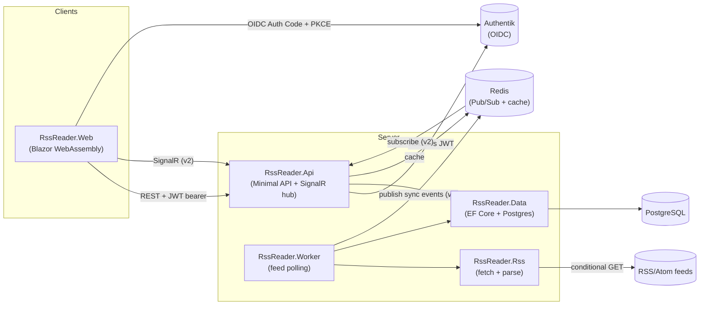
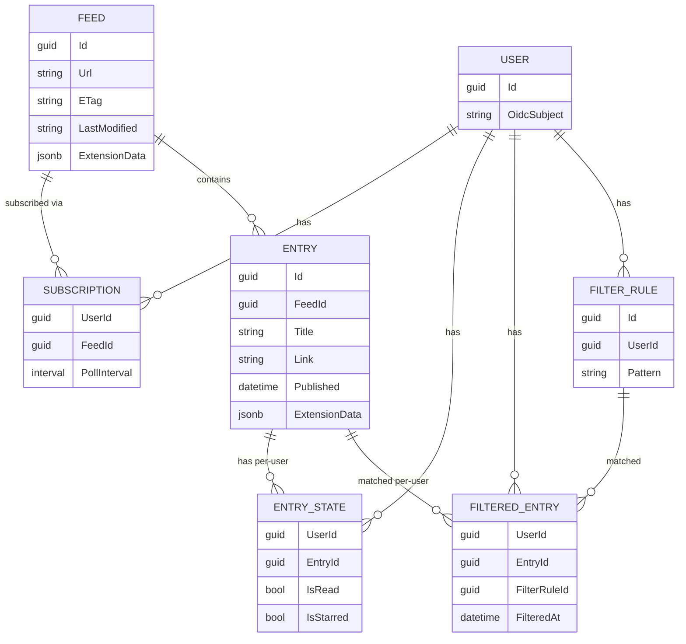

# Architecture

This describes the system's shape — components, responsibilities, and how they fit together. For *why*
these choices were made (feature scope, tech stack rationale, milestones), see `docs/ROADMAP.md`.

## Components

- **`RssReader.Api`** — client-facing Minimal API. Owns its own request/response DTOs; reads/writes via
  `RssReader.Data` directly. Validates JWT bearer tokens issued by Authentik. Also hosts the SignalR hub and
  a Redis cache client (v2, see [Real-Time Updates](#real-time-updates)).
- **`RssReader.Worker`** — background host; on each feed's configured interval, uses `RssReader.Rss` to
  fetch/parse and `RssReader.Data` to persist, then publishes a Redis Pub/Sub event (v2).
- **`RssReader.Rss`** — feed fetching (conditional GET via stored `ETag`/`Last-Modified`) and parsing
  (`System.ServiceModel.Syndication`, RSS 2.0 + Atom 1.0) plus "which feeds are due" logic. No dependency on
  `Data` or the hosts.
- **`RssReader.Data`** — EF Core entities (which *are* the domain model — no separate `Core` project),
  `DbContext`, and migrations, targeting PostgreSQL. References `RssReader.ServiceDefaults` for the Aspire
  PostgreSQL EF Core client integration.
- **`RssReader.Web`** — Blazor WebAssembly client. Performs the OIDC Authorization Code + PKCE flow against
  Authentik, then calls `RssReader.Api` over HTTP with the resulting bearer token, and (v2) connects to
  `RssReader.Api`'s SignalR hub for live updates.
- **`RssReader.AppHost`** — Aspire orchestration for local dev (Postgres + Api + Worker + Web + EF Core
  migrations) and the host for `Aspire.Hosting.Testing`-based integration tests.
- **`RssReader.ServiceDefaults`** — shared OpenTelemetry/health-check/resilience wiring referenced by `Api`,
  `Worker`, `Web`, and `Data`.

Api and Worker coordinate through the shared PostgreSQL database for feed data — no job queue between them
is needed. Starting in v2, Redis Pub/Sub carries ephemeral live-update notifications from Worker to Api's
SignalR hub (see [Real-Time Updates](#real-time-updates)); it is not a work/job queue, and Redis also serves
as a cache for rarely-changing feed/entry data.

## Data Model

> Entity/table names in the diagram below communicate the conceptual shape and relationships, not a literal
> schema spec — exact names, column types, indexes, and constraints are implementation details to be
> finalized when writing the actual EF Core entities/migrations.

Feeds and entries are global/shared (one `Feed` row and one set of `Entry` rows per unique feed URL,
regardless of subscriber count); per-user state lives in separate tables:

`EntryState` is dense but only for entries actually visible to a user — every ingested, non-filtered entry
gets exactly one row. `FilteredEntry` is a separate audit-only table: a filter-rule match at ingestion
produces a `FilteredEntry` row instead of an `EntryState` row, so it's never joined into normal
feed-listing/read paths. Filtering is evaluated once, at ingestion, and is never retroactive — editing or
deleting a `FilterRule` later doesn't touch existing `FilteredEntry` rows.

Feed-format variance and extensions (RSS 2.0 vs. Atom 1.0 structural differences, namespaced/custom fields)
are captured in a `jsonb` column rather than modeled relationally.

## Authentication Flow

1. `RssReader.Web` redirects to Authentik for login (OIDC Authorization Code + PKCE).
2. Authentik returns an authorization code; the web app exchanges it for tokens.
3. The web app calls `RssReader.Api` with the access token as a bearer token.
4. `RssReader.Api` validates the token against Authentik (standard OIDC/JWT bearer middleware) and maps the
   token's `sub` claim to an internal `User` record.

No local password/user store — no ASP.NET Core Identity.

## Real-Time Updates

v2 feature — v1 relies on manual refresh only. When `RssReader.Worker` finds new entries for a feed, it
publishes one small event per feed per sync cycle (not per entry) over Redis Pub/Sub. `RssReader.Api` holds
a dedicated listening connection and relays the event to the affected users' SignalR connections, driving
live new-entry/unread-counter updates and sync-health indicators in `RssReader.Web`. At-most-once delivery
is acceptable — a missed event self-corrects on the client's next event or reconnect-triggered refetch.

Cross-device/tab read-state sync (e.g. marking an entry read on one device updates another open session)
needs no cross-process messaging: the write happens via an `RssReader.Api` call, and `RssReader.Api` already
hosts the SignalR hub, so it pushes to the user's other connections in-process.

See `docs/ROADMAP.md`'s [Real-Time Updates and Hydration](../docs/ROADMAP.md#real-time-updates-and-hydration)
for the alternatives considered (Postgres `LISTEN`/`NOTIFY`, RabbitMQ) and why they were rejected.

## Deployment

Local development uses **.NET Aspire** (`RssReader.AppHost`) to orchestrate Postgres, `Api`, `Worker`, `Web`,
and EF Core migrations together.

Production targets a **VPS with Docker Compose** (already available). EF Core migrations run as a
standalone one-shot migration container image (via Aspire's `AddEFMigrations` +
`PublishAsMigrationBundle(publishContainer: true)`), applied before `Api`/`Worker` start — avoiding both an
auto-migrate-on-startup race between the two hosts and the need for a bespoke admin-triggered migration
endpoint. Whether `aspire publish` generates the production Compose artifacts directly, or
`docker-compose.yml` stays hand-maintained, is still to be trialed (see `docs/ROADMAP.md`'s Open Questions).

## Milestones

See `docs/ROADMAP.md` for the phased feature roadmap (v1 MVP → v2 → v3 → client expansion).
